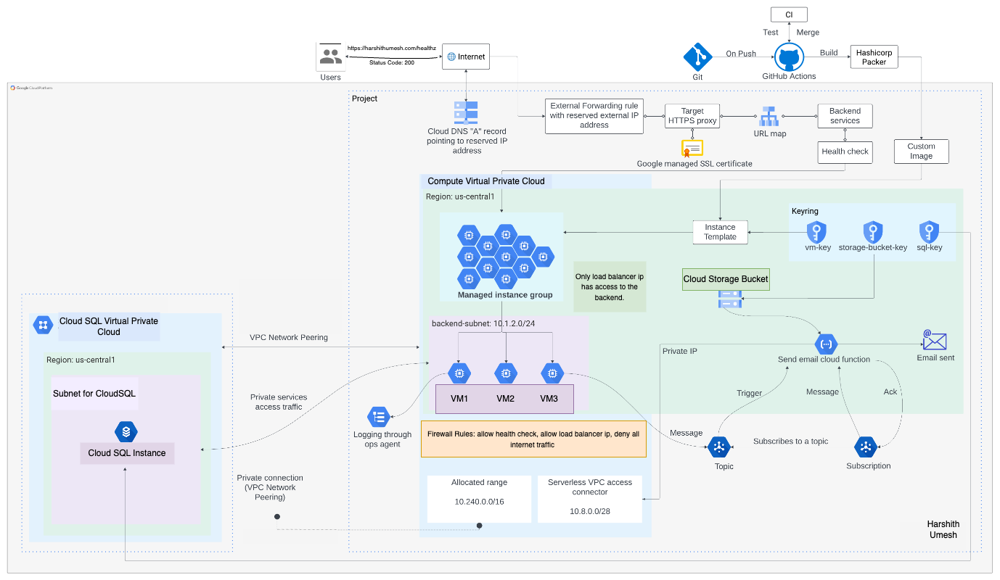

# GCP Flask User Management Application using Terraform

This repository contains the code for a RESTful API developed with Python and Flask, designed to manage user data with CRUD operations and health checks. The API is hosted on Google Cloud Platform and uses Terraform for infrastructure automation and Hashicorp Packer for custom image creation.

## Features

- **User Management**: Implements CRUD operations for managing user data.
- **Health Checks**: Includes an endpoint to check the health of the application and connected services.
- **Secure Setup**: Utilizes SSL certificates for HTTPS and customer-managed encryption keys for data security.
- **Scalability**: Supports high availability and scalability through managed instance groups and load balancing.
- **Event Handling**: Integrates Google Pub/Sub with Cloud Functions for sending verification emails via Mailgun.

## Architecture

The project utilizes a layered cloud architecture optimized for high availability and secure, scalable performance. Below is the cloud architecture diagram illustrating the setup:

## Key Technologies and Implementations

- **Infrastructure as Code (IaC):** Using Terraform, we automated the provisioning of cloud resources including VPCs, subnets, and routing tables, facilitating a repeatable and consistent setup across environments.
- **Custom Machine Images:** Leveraged Hashicorp Packer to create tailored virtual machine images on Centos Stream 8, optimizing deployment efficiency and ensuring consistency across computing environments.
- **Continuous Integration/Continuous Deployment (CI/CD):** GitHub Actions was utilized to automate testing, build Docker images, and manage rolling updates, enhancing the development workflow.
- **Database Configuration:** A private CloudSQL instance was configured with VPC peering to support secure database interactions. Database credentials are dynamically managed via VM metadata, improving security and integration ease.
- **Monitoring and Logging:** Google Ops Agent, configured on virtual machines, collects logs for the application, aiding in observability and issue resolution.
- **Event-Driven Architecture:** Google Pub/Sub is used to handle event-driven operations, like sending email verifications upon user registration, showcasing real-time data handling capabilities.
- **Load Balancing and Autoscaling:** Implemented using a managed instance group based on CPU utilization, alongside an external application load balancer and Google-managed SSL certificates for secure, scalable user access.
- **Security and Encryption:** Customer-managed encryption keys (CMEK) on GCP enhance data security across VMs, CloudSQL instances, and storage, with a strict 30-day rotation policy.

## Technology Stack

- **Python & Flask**: For building the RESTful API.
- **Google Cloud Platform**: Hosting and infrastructure services.
- **Terraform**: For infrastructure as code to provision GCP resources.
- **Hashicorp Packer**: For creating virtual machine images.
- **GitHub Actions**: Automates CI/CD pipeline for testing, building images, and deploying updates.

## Getting Started

### Prerequisites

- Google Cloud Platform account
- Terraform installed
- Flask installed
- Python 3.8 +

### Deployment

1. **Clone the repository**

- git clone https://github.com/yourusername/user-management-gcp-terraform.git
- cd user-management-gcp-terraform

2. **Initialize Terraform**

- terraform init

3. **Apply Terraform configuration**

- terraform apply
